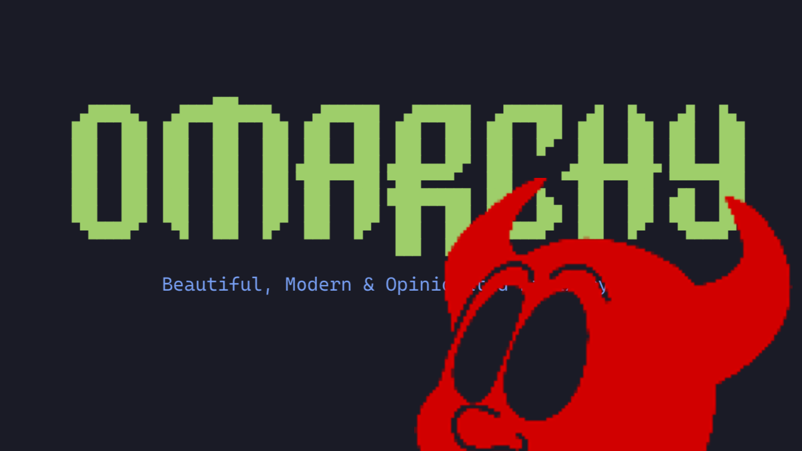
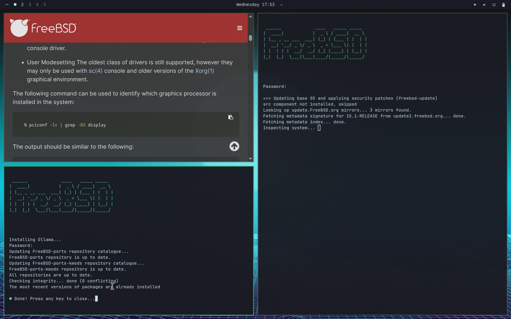

# FreeBSD-Omarchy

My favorite open-source operating system is FreeBSD. I also love OpenBSD (and
I've run GNU/Linux and created Linux distros since its dark early days).

The best UNIX UI in 2026, in my opinion, is Hyprland on top of Wayland. The
Omarchy Linux distribution gets it exactly right (except for the whole Linux
thing).

This project ports Omarchy's beautiful UI and its opinionated, chef's-choice
software to FreeBSD. BSD just needs to look good. Everything else is already
better.

This is my favorite operating system: the latest stable FreeBSD + the Omarchy
desktop experience.

Have fun!

[](https://github.com/klimb/freebsd-omarchy/raw/main/docs/demo.mp4)

## Install

There is no `omarchy` package in the official FreeBSD repo yet — it lives here,
in this repo. Start from a fresh, minimal FreeBSD install and run as your
**normal user** (not root — Hyprland refuses to run as root) with `doas`
already installed and configured (or run the bootstrap script as root once).

### Quick start (bootstrap script)

```sh
# 1. Get this repo
pkg install -y git       # if you don't already have it (run as root/doas)
git clone https://github.com/klimb/freebsd-omarchy
cd freebsd-omarchy

# 2. One-shot installer
sh bootstrap/install.sh
```

`bootstrap/install.sh` does everything for you:

- installs all packages (Hyprland, seatd, terminals, PipeWire, portals, fonts,
  CLI tools, …);
- installs `drm-kmod` and auto-detects your GPU, enabling the right KMS driver
  (`i915kms` for Intel, `amdgpu` for AMD) at boot;
- enables and starts `seatd` and `dbus`;
- adds you to the `video` group (seatd + GPU access);
- installs and configures `doas`, and sets your login shell to `bash`;
- clones the Omarchy dotfiles and applies the FreeBSD fixes (`omarchy-setup`).

When it finishes, **reboot** (to load the GPU driver and pick up the group and
shell changes), then start the desktop:

```sh
omarchy-session
```

### Alternative: build the port

If you'd rather go through the ports tree:

```sh
# Copy the port into your ports tree and build it
cp -R port/x11-wm/omarchy /usr/ports/x11-wm/omarchy
cd /usr/ports/x11-wm/omarchy && make install clean
```

The port pulls in the desktop via its dependencies and installs `omarchy-session`
and `omarchy-setup`. Then follow the printed `pkg-message`: enable `seatd`/`dbus`,
add yourself to the `video` group, load a KMS driver for your GPU, reboot, run
`omarchy-setup`, and finally `omarchy-session`.

## Start Omarchy

Log in to FreeBSD over a console and type:

```sh
omarchy-session
```

## Key differences from Omarchy

Omarchy Linux Distribution is essentially Arch Linux + Custom Installer + themed HyprLand Window Manager + Bundled pre-configured software.

This project keeps the same UI and dotfiles as Omarchy, but replaces every Linux-specific layer / technology underneath for its FreeBSD
equivalent:

| Layer | Omarchy | FreeBSD |
|---|---|---|
| **Operating System** | Arch Linux with 7.1.8 kernel | FreeBSD 15.1 |
| **UI** | Wayland + HyprLand | Wayland + HyprLand |
| **Installer** | custom Omarchy installer | default FreeBSD installer + port (this) |
| **Init / services** | systemd units | FreeBSD `rc.d` (`seatd_enable`, `dbus_enable` in `rc.conf`); a `systemctl` shim maps unit verbs (`enable`/`disable`→`sysrc`, `start`/`stop`/`restart`→`service`) |
| **Session / seat management** | `systemd-logind` | `seatd` (`LIBSEAT_BACKEND=seatd`); user must be in the `video` group |
| **Privilege escalation** | `sudo` | `doas`, with a passwordless rule scoped to `shutdown`/`acpiconf` so the GUI power menu can suspend/reboot without a controlling tty |
| **Login shell / scripting** | `bash` | `bash` installed as a dependency (all ~300 `omarchy-*` helpers are `#!/bin/bash`); a handful of Linux-only commands (`setsid`, `systemd-cat`, `flock`, GNU `base64`, `uwsm-app`) are shimmed in `~/.local/bin` |
| **Package management** | `pacman`/`yay` | FreeBSD has a better package manager: (1) `pkg` for binary packages and (2) the ports mechanism (for building packages from source) |
| **Networking** | NetworkManager (`nmcli`) | `wpa_supplicant` + `ifconfig`/`route` (`omarchy-wifi-freebsd`, `omarchy-network-status`, `omarchy-restart-wifi`); the QuickShell network panel falls back to this status data since it has no D-Bus/NetworkManager backend |
| **Power management** | `systemd-inhibit`, `systemd-run`, `acpi` | `acpiconf`/`sysctl`; shims translate the systemd calls where practical |
| **Compositor session launch** | `uwsm` + systemd user units | `omarchy-session` sets `XDG_RUNTIME_DIR`, `OMARCHY_PATH`, and Wayland/Qt env vars directly, then execs Hyprland; a generated `~/.config/hypr/autostart.lua` starts PipeWire/WirePlumber/the XDG portal without socket activation |
| **Containers / VMs** | Docker | instead of Docker (Linux technology), we'll use [Sylve](https://github.com/AlchemillaHQ/Sylve) UI for managing Bhyve / Jails (see [ROADMAP.md](ROADMAP.md)) |
| **Bluetooth** | BlueZ (`bluetoothctl`) | planned, not implemented yet (see [ROADMAP.md](ROADMAP.md)) |
| **Fingerprint auth** | `fprintd` | planned, not implemented yet (see [ROADMAP.md](ROADMAP.md)) |

## Why FreeBSD?

Running FreeBSD underneath instead of Arch Linux isn't just a preference —
it's a genuine upgrade in several ways:

- **ZFS as the default filesystem** — boot environments (snapshot/rollback a
  botched update in seconds), transparent compression, native encryption,
  and none of the "which Linux fs du jour" fragmentation.
- **One coherent base system** — the kernel, core utilities, and docs are
  developed and released together (`freebsd-update`, `man` pages for
  everything), instead of a kernel + hundreds of independently-versioned
  GNU/systemd components.
- **A real package story** — `pkg` for binary packages, the ports tree when
  you need to build from source or tweak options; no `pacman`/`yay`/AUR
  trust issues.
- **Jails** — lightweight, mature OS-level virtualization that predates
  Docker by over a decade, with no daemon required. Paired with
  [Sylve](https://github.com/AlchemillaHQ/Sylve) for a UI over jails/bhyve.
- **A battle-tested networking stack** — FreeBSD's TCP/IP stack (pf, the
  network buffer allocator, sendfile) powers some of the highest-traffic
  infrastructure on the internet, including Netflix's video-streaming CDN
  serving hundreds of terabits per second, plus WhatsApp and Sony.
- **Security-focused design** — Capsicum capability sandboxing, `pf`, jails,
  and `GELI`/ZFS native encryption give defense-in-depth beyond what a
  typical Linux desktop distro ships by default.
- **A simpler service model** — `rc.d` + `rc.conf` are plain shell, readable
  top to bottom, versus systemd's unit files, targets, and D-Bus machinery.
- **Stable, documented ABI and licensing** — permissive BSD license end to
  end, and a famously thorough Handbook.
- **bhyve** — a lightweight, base-system hypervisor (no separate daemon or
  kernel module stack to install) that Sylve builds its VM management on.
- **Linux binary compatibility (Linuxulator)** — can still run unmodified
  Linux binaries in a jail-like sandbox when no native port exists, so
  dropping Linux-as-a-host loses none of the ecosystem.
- **DTrace and friends built into base** — `dtrace`, `ktrace`, `truss` give
  production-safe, whole-system tracing out of the box, no extra tooling
  or kernel patches required.
- **Conservative, predictable releases** — a stable binary ABI within a
  major branch, `freebsd-update` binary patches instead of full rebuilds,
  and quarterly-branched ports so `pkg` stays in sync with the release —
  no surprise breakage from a rolling release.
- **Non-commercial governance** — developed by a community and the FreeBSD
  Foundation, not a single vendor, so there's no corporate incentive to
  force through disruptive changes (à la systemd) or bake in telemetry.
- **Higher code quality and testability** — the kernel and userland are
  developed in a single, tightly reviewed repository with a proper test
  suite (`kyua`), instead of thousands of independently maintained
  packages with wildly varying review standards.

See [ROADMAP.md](ROADMAP.md) for the full, area-by-area porting status and
[docs/design.md](docs/design.md) for the underlying design rationale.
